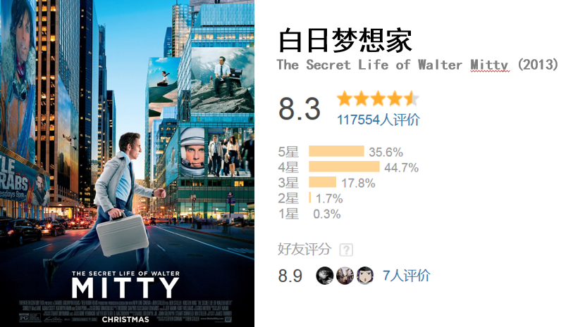

# 豆瓣网友装X吗？（电影篇）

## 项目介绍

平时，总能看到一些电影。虽然评分很高，但是却并不好看，比如

仔细对比其和国外网站，比如IMDB的评分，可以发现评分差别很大

可以看到，国内豆瓣的评分是8.3，而国外IMDB仅仅为7.3。烂番茄，Metacritic的评分也不高

是不是有一种可能，因为这些电影很文艺、很小资，所以豆瓣的用户很喜欢，所以打了高分呢？

换言之，是不是他们在装逼呢.... 本项目就是一次探索

## 具体内容

选取了2010-2014 北美上映的电影，比较豆瓣和IMDB评分，看看两者是不是存在很大的差别。

## Getting Started

1. 安装若干packages

    pip install -r requirements.txt

2. 数据具体分析，在`movie_compar.ipynb`中

3. `movie_compare.pptx` 为介绍时所用的PPT

