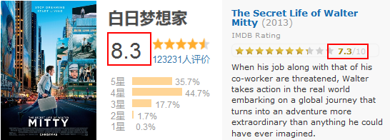

# 豆瓣电影的评分靠谱吗？ —— 一点数据分析的视角

## 1. 豆瓣和IMDB 电影评分的比较

平时，会碰到一些电影，虽然评分很高，但却并不觉得好看，比如白日梦想家

可以看到，国内豆瓣的评分是8.3，而国外IMDB仅仅为7.3。烂番茄，Metacritic的评分也不高

是不是有一种可能，因为这些电影很文艺、很小资，所以豆瓣的用户很喜欢，所以打了高分呢？ 

分析文章：[知乎](https://zhuanlan.zhihu.com/p/24815577), [豆瓣](https://www.douban.com/note/599456964/)

[交互式评分比较散点图](https://cdn.rawgit.com/cqcn1991/movie-compare/master/movie_compare_all.html)

完整的分析notebook, 见[这里](http://nbviewer.jupyter.org/github/cqcn1991/movie-compare/blob/master/application.ipynb)

## 2. 豆瓣电影评分差异的比较

电影西游伏妖篇，网上的评价差异很大，一方面，有人觉得挺不错，但另一方面，又有人直骂烂片

于是，会想问 —— 为什么有的电影分数高/低，但是我们并不认同？是不是豆瓣电影的分数有问题？

分析文章: [豆瓣地址](https://www.douban.com/note/624372911/)

[交互式评分比较散点图](https://cdn.rawgit.com/cqcn1991/movie-compare/master/clusters.html)

完整的分析notebook, 见[这里](http://nbviewer.jupyter.org/github/cqcn1991/movie-compare/blob/master/movie2.ipynb)

## 代码介绍

### Getting Started

0. 本项目基于Python 3，建议使用Anaconda安装

1. 安装若干packages

    pip install -r requirements.txt

2. 数据分析，见`application.ipynb` 和 `movie2.ipynb`

## Contact 

如果有任何问题，可以发issue，或者[在这里](https://www.douban.com/people/wohaobeia/)找我

